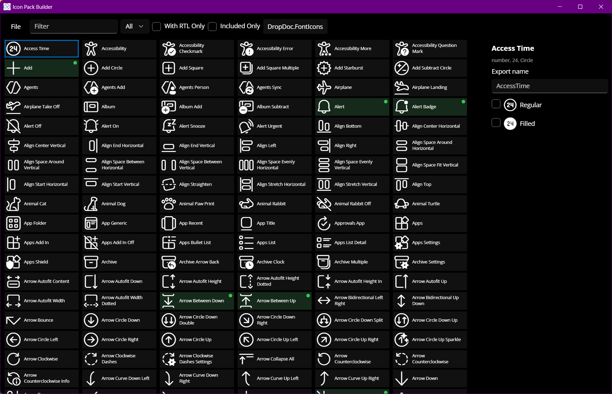

<div class="article">

# Getting Started

**Icon Pack Builder** creates trimmed, strongly-typed font icon packs for your application from the [Seagull Fluent Icons](https://github.com/davidxuang/FluentIcons) font, a single-font build of Microsoft's [Fluent UI System Icons](https://github.com/microsoft/fluentui-system-icons). You pick the icons and variants your app uses, and the builder exports:

- A **subset font** (`.otf`) containing only the glyphs you selected, typically a few tens of kilobytes instead of over a megabyte.
- A **generated C# class** with a static member per icon, so icons are referenced by name and the compiler catches typos.

Right-to-left versions of directional icons are included automatically (see [Right-to-Left Support](rtl-support.md)), and the small **Singulink.UI.Icons** support packages display the correct glyph for the current flow direction in each UI framework.



### Packages

| Package | Purpose |
| --- | --- |
| **Singulink.UI.Icons** | Base types used by generated packs (<xref:Singulink.UI.Icons.IIconGlyph>, <xref:Singulink.UI.Icons.IconGlyph>, <xref:Singulink.UI.Icons.IconWithRtlGlyph>). Framework-agnostic; sufficient on its own for Windows Forms or any framework that renders text. |
| **Singulink.UI.Icons.WinUI** | Flow direction aware font icons for WinUI 3 and Uno Platform. |
| **Singulink.UI.Icons.Wpf** | Flow direction aware font icons for WPF. |
| **Singulink.UI.Icons.Avalonia** | Flow direction aware font icons for Avalonia. |
| **Singulink.UI.Icons.Maui** | Flow direction aware font icons for .NET MAUI. |

Reference the base package from projects that only need to refer to icons (for example a view model project) and the framework package from the UI project.

### Building an Icon Pack

Icon Pack Builder lives in the [IconPackBuilder](https://github.com/Singulink/Singulink.UI/tree/main/IconPackBuilder) folder of the repository and runs on Windows (WinAppSDK) or as a cross-platform Skia desktop app. Build and run the `IconPackBuilder` project, or pass a project file on the command line to open it directly:

```
IconPackBuilder.exe MyApp.FontIcons.ipproj
```

1. **Create a project.** The project name must be in `Namespace.Class` format, for example `MyApp.FontIcons`. This becomes the namespace and class name of the generated code. The project is saved as a small JSON `.ipproj` file that you can commit alongside your app. The builder never locks the file, and reloads it if it changes on disk (for example after a branch switch), so it is safe to keep open while you work.
2. **Find icons.** The filter matches icon names and the metaphors (keywords) from Microsoft's icon metadata, so searching for "trash" finds Delete and "house" finds Home. The description of the selected icon is shown in the side panel. Use the variant dropdown to browse a single variant (Regular, Filled, Color or Light), **With RTL Only** to see icons that have a distinct right-to-left glyph, and **Included Only** to review your selection.
3. **Select variants.** Tick the variants you need for each icon. Each ticked variant becomes a member of the generated class: the first variant of the source (Regular) uses the icon name on its own, other variants append the variant name, e.g. `Save` and `SaveFilled`.
4. **Rename if needed.** The export name defaults to the icon's identifier. Override it to give an icon an app-specific name, e.g. export `Alert` as `Notifications`.
5. **Save and export.** Export writes a `<ProjectName>_Export` folder beside the project file containing the subset font `<ProjectName>.otf` and the generated `<Class>.cs`. **Preview** shows the exported icons rendered with the subset font.

The generated class looks like this:

```csharp
// <auto-generated>
// Generated by Icon Pack Builder
// </auto-generated>
using Singulink.UI.Icons;

namespace MyApp;

public static class FontIcons
{
    public static IconGlyph Add { get; } = new(0xF0008);
    public static IconWithRtlGlyph Back { get; } = new(0xF0048, 0x100048);
    public static IconGlyph Save { get; } = new(0xF03E4);
    public static IconGlyph SaveFilled { get; } = new(0xF03E5);
}
```

Every member implements <xref:Singulink.UI.Icons.IIconGlyph>, which exposes the code point and glyph string for both flow directions. Icons with a distinct right-to-left glyph are generated as <xref:Singulink.UI.Icons.IconWithRtlGlyph>; all others as <xref:Singulink.UI.Icons.IconGlyph>, whose right-to-left members simply return the regular glyph.

### Adding the Pack to Your App

1. Add the font file to the UI project as an asset (the exact mechanism depends on the framework; see the framework guides).
2. Add the generated `.cs` file to a project that references **Singulink.UI.Icons**. A shared project works well if view models need to pick icons.
3. Refer to the font by its family name, **Seagull Fluent Icons**. Subsetting does not change the family name.

Then follow the guide for your UI framework:

- [WinUI and Uno Platform](winui.md)
- [WPF](wpf.md)
- [Avalonia](avalonia.md)
- [.NET MAUI](maui.md)
- [Windows Forms](winforms.md)

### Updating a Pack

Re-open the `.ipproj`, adjust the selection and export again. Icon identifiers and code points are stable across Seagull releases, so an existing project keeps exporting the same code points when the builder is updated to a newer icon set; new icons simply become available.

</div>
